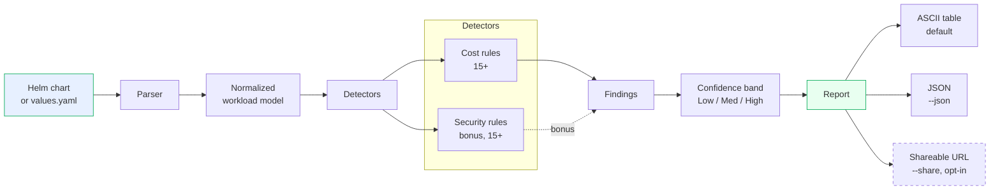
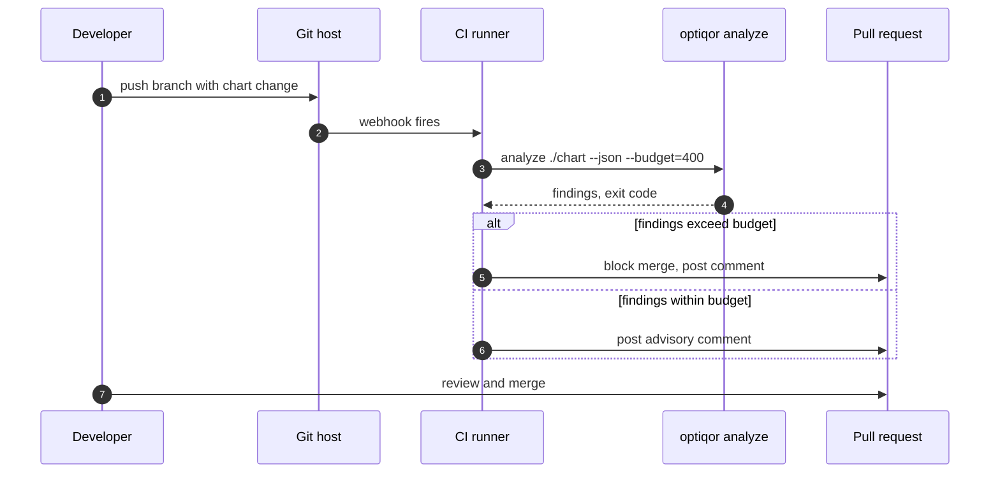
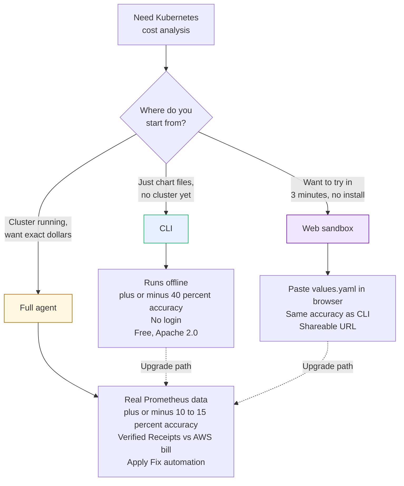

<p align="center">
  
</p>

<p align="center"><b>Detect. Fix. Prove.</b></p>
<p align="center">Kubernetes Helm cost analysis from your terminal. No login. No agent. No cluster connection required.</p>
<p align="center"><sub>Bonus: surfaces obvious security misconfigurations it spots along the way.</sub></p>

[](https://www.npmjs.com/package/@optiqor/cli)
[](LICENSE)
[](https://pkg.go.dev/github.com/optiqor/optiqor-cli)
[](https://github.com/optiqor/optiqor-cli/actions/workflows/ci.yml)
[](https://www.npmjs.com/package/@optiqor/cli)

```sh
npx @optiqor/cli analyze ./my-helm-chart
```

That is it. One command. No setup. No account. Cost findings for your Kubernetes workloads in under three seconds.

---

## Table of Contents

- [Why Optiqor CLI](#why-optiqor-cli)
- [Install](#install)
- [Quick Start](#quick-start)
- [How It Works](#how-it-works)
- [Commands](#commands)
- [Example Output](#example-output)
- [CI/CD Integration](#cicd-integration)
- [CLI vs Agent vs Sandbox](#cli-vs-agent-vs-sandbox)
- [Configuration](#configuration)
- [Privacy and Accuracy](#privacy-and-accuracy)
- [The Full Optiqor Platform](#the-full-optiqor-platform)
- [FAQ](#faq)
- [Contributing](#contributing)
- [License](#license)

---

## Why Optiqor CLI

Most Kubernetes cost tools require you to install an agent in your cluster, expose Prometheus, and wait 30 days for data. That is the right call for production teams who need exact numbers.

But sometimes you just want a directional answer **right now** about a chart you are reviewing.

The Optiqor CLI is a deterministic rule engine that reads your Helm chart files (or `values.yaml`) and reports cost inefficiencies in seconds. It runs fully offline. It does not phone home. It is honest about what it can and cannot tell from static files alone.

> [!TIP]
> **Bonus:** while it is parsing your chart for cost waste, it also flags the obvious Kubernetes security misconfigurations it sees (`runAsRoot`, `:latest` tags, missing `securityContext`, host namespaces, etc.). This is a side-effect of the parser — not the headline feature. If you need a real security posture tool, use one. If you happen to also catch them for free during a cost review, even better.

> [!NOTE]
> The CLI gives you **directional signal**, not exact numbers. For exact dollar savings backed by 30 days of real Prometheus data and your AWS bill, install the [Optiqor agent](https://optiqor.dev/get) in your cluster.

---

## Install

### Option 1: npx (zero-install, recommended for one-off use)

```sh
npx @optiqor/cli analyze ./chart
```

### Option 2: Global npm install

```sh
npm install -g @optiqor/cli
optiqor analyze ./chart
```

### Option 3: Go install

```sh
go install github.com/optiqor/optiqor-cli/cmd/optiqor@latest
```

### Option 4: Download a release binary

Pre-built binaries for Linux (amd64, arm64) and macOS (amd64, arm64) are published on every tagged release.

```sh
# Linux amd64
curl -L https://github.com/optiqor/optiqor-cli/releases/latest/download/optiqor_linux_amd64.tar.gz | tar -xz
sudo mv optiqor /usr/local/bin/
```

> [!TIP]
> All release artifacts are signed with [Cosign](https://github.com/sigstore/cosign). Verification instructions on the [release page](https://github.com/optiqor/optiqor-cli/releases).

### Option 5: Build from source

Requirements: Go 1.23+ and `make` (the Makefile drives a `-trimpath` reproducible build with the version stamped from `git describe`).

```sh
git clone https://github.com/optiqor/optiqor-cli
cd optiqor-cli

# Recommended — produces ./bin/optiqor with version baked in:
make build
./bin/optiqor demo

# Plain `go build` works too:
go build -o optiqor ./cmd/optiqor
./optiqor demo

# Install onto your $PATH:
make install            # uses go install with the same -trimpath/ldflags
# or:
go install github.com/optiqor/optiqor-cli/cmd/optiqor@latest
```

Other useful targets: `make test` (race-enabled, no caching), `make lint` (golangci-lint), `make vet`, `make fmt`, `make release-dryrun` (GoReleaser snapshot), `make clean`.

---

## Quick Start

```sh
# Run the bundled demo (no input needed)
npx @optiqor/cli demo

# Analyze a chart directory
npx @optiqor/cli analyze ./my-chart

# Analyze a single values file
npx @optiqor/cli analyze ./values.production.yaml

# Compare two values files
npx @optiqor/cli diff ./values.dev.yaml ./values.prod.yaml

# Score a chart against best practices (0-100)
npx @optiqor/cli score ./my-chart

# Get JSON output for tooling
npx @optiqor/cli analyze ./my-chart --json | jq '.findings[]'
```

---

## How It Works



The pipeline is deterministic. The same input always produces the same output. There are no LLM calls in the CLI itself; the LLM-driven Apply Fix flow lives in the SaaS backend.

---

## Commands

| Command | Purpose | Status |
| --- | --- | --- |
| `analyze [chart]` | Run cost analysis on a chart or values file (security findings included as a bonus) | Stable |
| `demo` | Run analysis on a bundled demo chart | Stable |
| `diff <a> <b>` | Show cost delta between two values files | Stable |
| `score [chart]` | Assign a 0–100 efficiency score with confidence band | Stable |
| `audit [chart]` | Bonus: security findings only (no cost detectors) | Stable |
| `compare <a> <b>` | Currently an alias for `diff` (richer output ships in Phase 7) | Beta |
| `watch [chart]` | Re-analyze on file change | Coming soon |
| `--version` | Print version and exit | Stable |
| `--help` | Help for any command | Stable |

### Filter and exit-code flags

| Flag | Effect |
| --- | --- |
| `--json` | Emit machine-readable JSON (every command) |
| `--no-color` / `NO_COLOR=1` | Disable ANSI output; auto-detected when piped |
| `--severity low\|med\|high` | Drop findings below the threshold (analyze) |
| `--detector <id>` | Repeatable allow-list, e.g. `--detector cpu-overprovisioned --detector image-pinned-latest` |
| `--fail-on low\|med\|high` | Exit code 1 if any finding meets/exceeds the severity (analyze, audit) |
| `--config <path>` | Load `.optiqor.yaml` from a custom path (default `./.optiqor.yaml` or `$OPTIQOR_CONFIG`) |

### Exit codes

| Code | Meaning |
| --- | --- |
| `0` | No findings at or above the threshold (or threshold unset) |
| `1` | Findings reported and `--fail-on` threshold met |
| `2` | Invocation error (bad path, malformed YAML, invalid flag) |
| `3` | Unexpected runtime error |

### Persistent config

A `.optiqor.yaml` in the working directory (or pointed at via `--config` / `OPTIQOR_CONFIG`) lets you persist defaults:

```yaml
# .optiqor.yaml
min_severity: med
fail_on: high
detectors:
  - cpu-overprovisioned
  - missing-memory-limit
  - image-pinned-latest
no_color: false
```

Flags always override config values when supplied.

---

## Example Output

`npx @optiqor/cli demo` produces a branded report with an executive summary, a boxed cost-finding card per optimization (with an inline `request ████░░░░ limit` ratio bar), and a compact "bonus" block for security misconfigurations spotted while parsing.

```
────────────────────────────────────────────────────────────────────────────────
  ◐  optiqor
  Helm chart cost optimization · security as a bonus
────────────────────────────────────────────────────────────────────────────────

  Source      demo
  Workloads   15 workloads analyzed
  Cost        25 optimizations · save ~$35.39/mo (~$424.68/yr) ±40%
  Security    49 findings — bonus, surfaced while parsing

━━ Cost optimizations ━━━━━━━━━━━━━━━━━━━━━━━━━━━━━━━━━━━━━━━━━━━━━━━━━━━━━━━━━━

  ┌─ MED · api ──────────────────────────────────────────────── save ~$29.20/mo ─┐
  │                                                                              │
  │ CPU request appears overprovisioned                                          │
  │                                                                              │
  │ CPU      2      ███████████████████░░░░░ 2.5   80% of limit                  │
  │                                                                              │
  │ Request 2 vs limit 2.5 — typical utilization rarely justifies this           │
  │ ratio. Consider halving the request.                                         │
  │                                                                              │
  │ confidence: ●●○ medium                                                       │
  └──────────────────────────────────────────────────────────────────────────────┘

  …  more cost cards, ordered by savings descending

━━ Security findings  (bonus, 49) ━━━━━━━━━━━━━━━━━━━━━━━━━━━━━━━━━━━━━━━━━━━━━━
  Spotted while parsing your chart. Cost is the headline; this is a bonus.

   HIGH   admin-tool      ●●●   allowPrivilegeEscalation explicitly enabled
   HIGH   admin-tool      ●●●   Container declared privileged
   HIGH   admin-tool      ●●●   Container runs as root
   MED    api             ●●○   runAsNonRoot not declared
   …

  Run `optiqor audit` to focus only on these findings.

────────────────────────────────────────────────────────────────────────────────
  estimated monthly savings: $35.39/mo   (±40%)
  Sandbox accuracy: ±40%. Install the Optiqor agent for exact numbers (optiqor.dev/get).
  → install the agent for exact numbers: optiqor.dev/get
```

### `--roast` mode

Same findings, snarkier titles. Detail text, severities, dollar estimates, and the mandatory accuracy disclosure are unchanged — only `Title` and the brand tagline get a tone-pass. Zero LLM calls; the rewrite is a static map of detector ID → snark.

```sh
npx @optiqor/cli demo --roast
```

```
  Helm chart cost roast — your YAML deserves it
  …
  ┌─ MED · api ──────────────────────────────────────────────── save ~$29.20/mo ─┐
  │ CPU on a buffet plan, eating air                                             │
  │ CPU      2      ███████████████████░░░░░ 2.5   80% of limit                  │
  …
  Receipts > vibes. Install the agent for the actual bill: optiqor.dev/get
```

### `score` — letter grade + percentile

`optiqor score` puts the social-shareable signal up top: a letter grade with a percentile rank against a baked-in benchmark distribution. The numeric 0–100 score still appears for CI gates and analytics.

```sh
npx @optiqor/cli score ./my-chart
```

```
  ◐  optiqor score   Helm chart efficiency grade

  Source      ./my-chart/values.yaml
  Workloads   8 analyzed

  Grade        B+   better than 64% of 100 benchmark charts
  Score        82 / 100   ●●○ medium

  Penalty breakdown
    cpu-overprovisioned                 -10
    image-pinned-latest                 -8
    …

  Calibration: static benchmark distribution; agent install unlocks live percentile vs your fleet.
```

The calibration is a static distribution baked into the binary — no telemetry, no network call. Live percentiles against your fleet land with the agent install.

---

## CI/CD Integration

The CLI is designed to run inside a CI pipeline. Use exit codes to gate merges, or post the report as a PR comment.



### GitHub Actions

```yaml
name: Optiqor
on:
  pull_request:
    paths: ["charts/**", "values/**"]

jobs:
  analyze:
    runs-on: ubuntu-latest
    steps:
      - uses: actions/checkout@v4
      - uses: actions/setup-node@v4
        with:
          node-version: "20"
      - name: Run Optiqor
        run: npx @optiqor/cli analyze ./charts/api --json > report.json
      - name: Comment on PR
        run: |
          npx @optiqor/cli analyze ./charts/api \
            | gh pr comment ${{ github.event.pull_request.number }} --body-file -
        env:
          GH_TOKEN: ${{ secrets.GITHUB_TOKEN }}
```

### GitLab CI

```yaml
optiqor:
  image: node:20-alpine
  rules:
    - if: $CI_PIPELINE_SOURCE == "merge_request_event"
      changes: [charts/**, values/**]
  script:
    - npx @optiqor/cli analyze ./charts/api --json > report.json
  artifacts:
    paths: [report.json]
```

### pre-commit

```yaml
# .pre-commit-config.yaml
repos:
  - repo: local
    hooks:
      - id: optiqor-analyze
        name: Optiqor analyze
        entry: npx @optiqor/cli analyze
        language: system
        files: '^charts/.*\.ya?ml$'
        pass_filenames: true
```

---

## CLI vs Agent vs Sandbox



| Surface | Accuracy | Setup | When to use |
| --- | --- | --- | --- |
| **Web sandbox** | plus or minus 40 percent | None, paste in browser | Curiosity, sharing a one-off finding |
| **CLI** (this repo) | plus or minus 40 percent | One npx command | PR review, CI gating, offline workflows |
| **Full agent + SaaS** | plus or minus 10 to 15 percent | Helm install, ~30 minutes | Production teams, paying customers, verified Receipts |

---

## Configuration

### Flags

| Flag | Default | Description |
| --- | --- | --- |
| `--json` | false | Emit machine-readable JSON |
| `--offline` | true | Do not perform any network calls |
| `--share` | false | Upload sanitized analysis to optiqor.dev (opt-in) |
| `--no-color` | false | Disable ANSI color in output |
| `--quiet` | false | Suppress all output except findings |
| `--budget=<USD>` | unset | Exit non-zero if estimated savings exceed this dollar threshold |
| `--ignore=<rule-id,...>` | empty | Skip specific detector rules |
| `--namespace=<name>` | unset | Filter to a single namespace if the chart deploys to multiple |

### Environment Variables

| Variable | Purpose |
| --- | --- |
| `OPTIQOR_NO_COLOR` | Disable color output (CI-friendly, equivalent to `--no-color`) |
| `OPTIQOR_OFFLINE` | Force offline mode |
| `OPTIQOR_SHARE_BASE_URL` | Override the share endpoint (for self-hosted Optiqor) |
| `OPTIQOR_SKIP_POSTINSTALL` | Skip the npm postinstall binary download (for offline npm caches) |

---

## Privacy and Accuracy

The CLI was designed to be unambiguously honest about its limitations. Three rules baked into the binary:

> [!IMPORTANT]
> **Accuracy is plus or minus 40 percent.** Every analysis output ends with a disclosure stating this. If you need exact numbers, you need real cluster metrics. The CLI deliberately cannot give you that.

> [!IMPORTANT]
> **No telemetry by default.** The CLI does not phone home. It does not collect usage statistics. It does not check for updates over the network unless you explicitly opt in.

> [!IMPORTANT]
> **`--share` is opt-in only.** When you pass `--share`, a sanitized version of your analysis is uploaded to `optiqor.dev/r/<hash>` for sharing. Sanitization removes commit author emails, repo paths, and free-text comments. The unsanitized analysis is never sent anywhere.

If you want to verify any of these claims, the entire CLI is Apache 2.0 and lives in this repository. Read the source.

---

## The Full Optiqor Platform

Optiqor is a three-layer platform. This CLI is the open, free entry point to the first layer. The full platform binds all three with the same trust contract.

| Layer | Component | What it does |
| --- | --- | --- |
| 1. Detect | **Optiqor Detect** | Cost analysis from real Prometheus data and Helm/Kustomize files. The CLI is the offline subset of this. (Bonus: security misconfigurations spotted along the way.) |
| 2. Fix | **Optiqor Apply** | One-click Apply Fix PRs with the exact Helm values diff, gated by `kubectl --dry-run=server` against your live cluster. |
| 3. Prove | **Optiqor Prove** | Ed25519-signed Receipts of realized savings, verified against your AWS / Azure / Hetzner bill. Public, independently verifiable, transparency-logged. |

The CLI is free, open source, deliberately limited to plus or minus 40 percent accuracy because static files are all it sees. **The full platform turns the CLI's directional findings into exact dollar savings, automated PRs, and cryptographically verified Receipts against your actual cloud bill.**

```mermaid
flowchart LR
    PR[Helm or Kustomize PR] --> DETECT[Optiqor Detect<br/>analysis under 30s]
    DETECT --> APPLY[Optiqor Apply<br/>Apply Fix PR opens]
    APPLY --> MERGE[You merge]
    MERGE --> WATCH[7-day Auto-Rollback<br/>watchdog]
    WATCH --> MEASURE[Measure savings<br/>against cloud bill]
    MEASURE --> PROVE[Optiqor Prove<br/>Ed25519 Receipt]
    PROVE --> SHARE[Share with finance,<br/>verify independently]

    style DETECT fill:#e7f0ff,stroke:#0a5
    style APPLY fill:#fff7e0,stroke:#a60
    style PROVE fill:#e8fff0,stroke:#0a5
```



### What you get when you install the agent

| Capability | CLI (this) | Full Platform |
| --- | --- | --- |
| Cost analysis from chart files | Yes | Yes, plus exact numbers from real Prometheus |
| Security findings as a bonus side-effect | Yes | Yes |
| **Apply Fix** — one-click PR with the exact Helm diff | No | Yes |
| **Verified Receipts** — Ed25519-signed proof of savings against your AWS bill | No | Yes |
| **Auto-Rollback Guarantee** — 7-day post-merge watchdog opens a rollback PR if metrics drift | No | Yes |
| **Cost Spike detection** — bill anomaly mapped back to the merged PR that caused it | No | Yes |
| Workload classification — bursty workers sized differently than steady web services | No | Yes |
| Cluster-aware sizing — Karpenter, Cluster Autoscaler, AKS, GKE, Hetzner | Static only | Yes, all five |
| GitHub + GitLab integration with @optiqor thread Q&A | No | Yes |
| Operator-aware fixes — Prometheus Operator, Strimzi, cert-manager, Istio | No | Yes |
| Slack digest, customer dashboard, multi-cluster fleet view | No | Yes |
| SOC 2 Type 1, GDPR, EU data residency | n/a | Yes |

### How customers use it

> [!TIP]
> **Three-minute path:** paste your `values.yaml` at [optiqor.dev/sandbox](https://optiqor.dev/sandbox). No login. See what the SaaS would tell you, with the same plus-or-minus-40-percent disclosure as this CLI.

> [!TIP]
> **Ten-minute path:** install the GitHub or GitLab App. The next PR you open against any Helm chart in the connected repo gets an Optiqor comment with cost findings (plus any security misconfigurations spotted along the way). Still sandbox accuracy until you install the agent.

> [!TIP]
> **Thirty-minute path:** `helm install optiqor-agent` in your cluster. Within 30 days you receive your first signed Receipt proving exact dollar savings against your AWS, Azure, or Hetzner bill.

### Pricing

| Plan | Price | What is included |
| --- | --- | --- |
| **Free** | $0 forever | 2 clusters, one verified Receipt per month, all detectors |
| **Team** | $500 / month | 5 clusters, unlimited Receipts, Slack digest, dashboard |
| **Enterprise** | Custom | Unlimited clusters, dedicated CSM, SLA, in-VPC option, EU residency |

Ship with confidence: every recommendation is paired with a Confidence band, every Apply Fix is gated by `kubectl --dry-run=server` against your live cluster, every merged change is watched for 7 days, and every claimed dollar of savings is signed against the real cloud bill.

[**Try the sandbox**](https://optiqor.dev/sandbox) - [**Install the agent**](https://optiqor.dev/get) - [**Book a demo**](https://optiqor.dev/demo) - [**Read the architecture**](https://optiqor.dev/how-it-works)

---

## Public Go API

Everything under [`pkg/`](pkg/) is the stable public surface. Anything under `internal/` is CLI-side composition and may change without notice.

| Package | Purpose |
| --- | --- |
| [`pkg/parser`](pkg/parser) | Helm `values.yaml` → normalised `Workload` model: resources, image refs, `securityContext`, replicas |
| [`pkg/rules`](pkg/rules) | The full 30-detector library (15 cost + 15 security as a bonus), the `Detector` interface, `Finding`, severity / confidence enums, and the `All()` registry |

```go
import (
    "github.com/optiqor/optiqor-cli/pkg/parser"
    "github.com/optiqor/optiqor-cli/pkg/rules"
)

func analyze(values io.Reader) ([]rules.Finding, error) {
    workloads, err := parser.ParseValues(values)
    if err != nil {
        return nil, err
    }
    return rules.Run(workloads, rules.All()), nil
}
```

The Optiqor proprietary backend imports these two packages directly via `go.mod`; this is *the* mechanism by which the SaaS reuses CLI rule definitions instead of forking them. New detectors land in `pkg/rules` first, the backend follows automatically. Breaking changes to anything under `pkg/` go through semver and a deprecation notice.

---

## FAQ

<details>
<summary><b>Why is the CLI rule-based instead of LLM-driven?</b></summary>

Determinism. The same chart should produce the same findings every time. LLMs are non-deterministic and would make CI gating unreliable. The LLM-driven Apply Fix flow lives in the [Optiqor SaaS](https://optiqor.dev) where every recommendation is paired with measured outcomes via Verified Receipts.

</details>

<details>
<summary><b>Does this work on my Kustomize / ArgoCD / Flux setup?</b></summary>

Yes for any setup that produces Helm-renderable YAML. The CLI parses the rendered output, not the source format. ArgoCD `Application` manifests with Helm sources work directly. Flux `HelmRelease` resources work directly. Kustomize overlays work after `kustomize build`.

</details>

<details>
<summary><b>What about my Hetzner / on-prem / AKS / GKE cluster?</b></summary>

The CLI is cluster-agnostic. It reads chart files; it does not care where the cluster runs. Note that **dollar estimates** in the output assume AWS pricing today. EUR-denominated estimates for Hetzner customers ship in Q3 2026 alongside the EU GA of the SaaS.

</details>

<details>
<summary><b>How do I extend it with my own detectors?</b></summary>

The detector library is exported as a stable Go package at [`pkg/rules`](pkg/rules) — see [Public Go API](#public-go-api) below. To add a detector to the upstream library, drop a new file under `pkg/rules/` implementing the `Detector` interface and register it in `pkg/rules/types.go::All()`. PRs adding genuinely useful new detectors are welcome — see [CONTRIBUTING.md](CONTRIBUTING.md).

</details>

<details>
<summary><b>Is this a Kubecost competitor?</b></summary>

No. Kubecost is a cluster-installed cost dashboard. We are a static-analysis CLI plus a PR-layer SaaS. Many Optiqor users also run Kubecost for their dashboard view; the products are complementary.

</details>

<details>
<summary><b>How do I report a security issue?</b></summary>

See [SECURITY.md](SECURITY.md). Email `security@optiqor.dev`. Do not open public GitHub issues for security bugs.

</details>

---

## Contributing

Contributions are welcome. See [CONTRIBUTING.md](CONTRIBUTING.md) for the full guide. Highlights:

- All commits use [Conventional Commits](https://www.conventionalcommits.org/) (`feat(parser): support kustomize overlays`)
- All commits require DCO sign-off (`git commit -s`)
- Behavior changes need a golden test in `testdata/fixtures/`
- No LLM calls, no telemetry, no Windows-specific code paths (these are project-defining constraints)
- See [CODE_OF_CONDUCT.md](CODE_OF_CONDUCT.md)

Good first issues are labeled [`good-first-issue`](https://github.com/optiqor/optiqor-cli/labels/good-first-issue).

---

## Community

- **Discussions** — [github.com/optiqor/optiqor-cli/discussions](https://github.com/optiqor/optiqor-cli/discussions)
- **Issues** — [github.com/optiqor/optiqor-cli/issues](https://github.com/optiqor/optiqor-cli/issues)
- **Security** — `security@optiqor.dev` (see [SECURITY.md](SECURITY.md))
- **General** — [`hello@optiqor.dev`](mailto:hello@optiqor.dev)

---

## About the name

**Optiqor** — *optimize* + *quorum*. A quorum of deterministic detectors that agree on what to optimize before anything ships. Detect waste, fix it, prove it.

---

## License

Apache License 2.0. See [LICENSE](LICENSE).

> [!NOTE]
> The CLI is the only part of Optiqor that is open source. The SaaS backend, in-cluster agent, and Apply Fix infrastructure are proprietary. The CLI is independently buildable, independently auditable, and independently licensable; it never imports proprietary code.

---

<sub>Optiqor is a product of Optiqor, Inc. Trademark and brand assets are not licensed under Apache 2.0.</sub>
